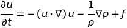

<p align="center">
  
  
  
</p>

# 2D Fluid Simulator using OpenGL

This project is an implementation of an eulerian fluid simulation on GPU using OpenGL 4.3 compute shaders capabilities.

## Getting Started
You will need OpenGL with a version above 4.3 in order to get compute shader capabilities. You will also need [GLFW](https://www.glfw.org/) and [Boost](https://www.boost.org/) installed on your machine. To project uses CMake to generate the Makefile needed for the compilation. You can use these commands to build the executable

```
mkdir build
cd build
cmake ..
make
```

You can query the program options using `-h`.

## Numerical Scheme
We solve the Navier-Stokes equation for incompressible fluids:
<p align="center">
  
</p>

As every eulerian approaches, the quantites (velocties, pressure, divergence, curl and so on) are stored in a square grid. The simulation is breaked down into an advection step using a [Maccormack](http://physbam.stanford.edu/~fedkiw/papers/stanford2006-09.pdf) scheme and a poisson equation of the Helmholtz decomposition (using a Jacobi method) to make the fluid divergence free. The simulation also contains the vorticity confinement method (which computes the curl of the velocity field and then add the forces to it).

## Implementation
Each quantities is represented by a texture of 16bits floating points on the GPU. For exact texels query, I use the texelFetch method (which runs faster than using texture2D) and then handle the boundary cases by hand. The bilinear interpolation for the advection step is also computed by hand for better accuracy. The implementation contains three main classes:
1. `GLFWHandler` is the GLFW wrapper that contains the OpenGL initilization and the main program loop
2. `SimulationBase` which is a pure virtual function that gives the interface for the simulation. The main loop of the program accesses the `shared_texture` variable and display the associated texture on screen. This is where the various textures are created and stored.
3. `SimulationFactory` which contains helpers for computing steps of the simulation (like advection, pressure projection, etc). This class does not allocate GPU memory, but is instead feeded by the simulation loop.

If you (ever) wish to play around this simulation, you should create a new class that inherits from `SimulationBase` and uses the `SimulationFactory` to compute whatever you need to compute. This new class must overload `Init()`, `Update()`, `AddSplat()`, `AddSplat(const int)` and `RemoveSplat()` for the simulation to work.

## References
1. [@](http://jamie-wong.com/2016/08/05/webgl-fluid-simulation/): a simple tutorial on fluid simulation
2. [@](https://www.cs.ubc.ca/~rbridson/fluidsimulation/fluids_notes.pdf): this awesome books covers a lot of techniques for simulating fluids (classic!)
3. [@](https://www.cs.cmu.edu/~kmcrane/Projects/GPUFluid/): from GPU gems 3
4. [@](https://cg.informatik.uni-freiburg.de/intern/seminar/gridFluids_GPU_Gems.pdf): from GPU gems 1

## Nice github projects
1. [tunabrain/gpu-fluid](https://github.com/tunabrain/gpu-fluid): 2D fluid simulation on the GPU using an hydrid approach (FLIP)
2. [PavelDoGreat/WebGL-Fluid-Simulation](https://github.com/PavelDoGreat/WebGL-Fluid-Simulation): online fluid simulation

